# ☕ Bootcamp JavaScript Full Stack — Generation Brasil (Turma 13)

<br />

<div align="center">
  
</div>

<br />

<div align="center">

[](https://developer.mozilla.org/pt-BR/docs/Web/JavaScript)
[](https://nodejs.org/)
[](https://www.npmjs.com/package/readline-sync)
[](https://brazil.generation.org/)
[](LICENSE)
[](#)

</div>

---

## 🔗 Acesso e Execução

Este repositório consiste em uma coleção de scripts utilitários e algoritmos de terminal (CLI) desenvolvidos em ambiente **Node.js**. A execução de cada módulo é realizada diretamente via linha de comando local.

---

## 📖 Visão Geral

Este repositório reúne o conjunto completo de exercícios práticos, estudos conceituais e desafios de codificação desenvolvidos durante as semanas iniciais do **Bootcamp JavaScript Full Stack** ofertado pela [Generation Brasil](https://brazil.generation.org/) (Turma 13).

O objetivo pedagógico central é construir uma fundação sólida de **Lógica de Programação**, **Pensamento Computacional** e domínio da sintaxe do **JavaScript moderno (ECMAScript 6+)** sob a runtime do **Node.js**. O material cobre desde operações básicas de entrada e saída (I/O síncrono de console), manipulação de variáveis e operadores (aritméticos, relacionais, lógicos e unários), estruturas condicionais (`if/else`, operador ternário e seleção múltipla com `switch/case`), laços de repetição determinísticos e indeterminados (`for`, `while`, `do...while`), até estruturas de dados fundamentais na memória (vetores unidimensionais e matrizes bidimensionais).

---

## ✨ Funcionalidades

O repositório é segmentado por módulos didáticos e aulas práticas, abrangendo as seguintes funcionalidades:

### 🔰 Introdução e Entrada/Saída (`hello-world/`)
* **Primeiro Programa & I/O Síncrono (`HelloWord.js`)**: Demonstração de saída padrão (`console.log`), tipagem básica, imutabilidade com `const`, mutabilidade com `let` e captura síncrona de strings e inteiros do usuário via `readline-sync`.

### 🧮 Variáveis, Tipos e Operadores (`aula_02/`)
* **Atribuição Composta (`Atribuicao.js`)**: Operadores aritméticos combinados (`+=`) com tomada de decisão preliminar.
* **Concatenação e Interpolação (`Concatenacao.js`)**: Comparação prática entre concatenação tradicional de strings (`+`) e template literals com interpolação (sintaxe backticks `` `...${expressao}` ``).
* **Pré e Pós-Incremento (`PreIncremento.js` / `PosIncremento.js`)**: Análise da precedência de avaliação em tempo de execução de operadores unários (`++variavel` versus `variavel++`).
* **Operadores Relacionais e Coerção (`Relacionais.js`)**: Demonstração da igualdade frouxa (`==`) versus igualdade estrita (`===`), evidenciando a prevenção de coerção de tipos implícita.
* **Escopo e Modo Estrito (`Variaveis.js`)**: Aplicação da diretiva `"use strict"`, escopo de bloco (`let`/`const`) versus escopo de função (`var`), operador `typeof` e internacionalização de moeda com a API nativa `Intl.NumberFormat`.
* **Exercícios de Fixação Financeira e Matemática (`aula_02/exercicios/`)**:
  * `exercicio-1.js`: Leitura de salário base e abono complementar, efetuando o cálculo da remuneração atualizada formatada em Real brasileiro (`R$`).
  * `exercicio-2.js`: Captura interativa de 4 notas de participante através de laço e armazenamento em array, com cálculo e exibição da média aritmética ponderada (`toFixed(1)`).
  * `exercicio-3.js`: Algoritmo de folha de pagamento: `Salário Líquido = Salário Bruto + Adicional Noturno + (Horas Extras * 5) - Descontos`.
  * `exercicio-4.js`: Cálculo de dispersão algébrica: cálculo da diferença entre o produto de dois pares de fatores `(n1 * n2) - (n3 * n4)`.

### 🔀 Estruturas Condicionais e Seleção Múltipla (`aula_03/`)
* **Condicional Simples e Composta (`condicional_if/`)**:
  * `exercicio_1.js`: Verificação relacional de três valores `A`, `B` e `C`, identificando se `A + B > C`, `A + B < C` ou `A + B == C`.
  * `exercicio_2.js`: Avaliação de paridade e polaridade numérica simultânea (Par/Ímpar via operador módulo `% 2 === 0` e Positivo/Negativo/Neutro via comparações relacionais).
  * `exercicio_3.js`: Sistema de triagem para doação de sangue baseado em faixa etária (18 a 69 anos) com restrição estrita para doadores entre 60 e 69 anos (apenas doadores recorrentes).
  * `exercicio_4.js`: Árvore de decisão taxonômica completa (Classificação Zoológica) baseada em três características hierárquicas (Vertebrado/Invertebrado -> Ave/Mamífero/Inseto/Anelídeo -> Alimentação).
* **Seleção Múltipla com Switch Case (`condicional_switch/`)**:
  * `exercicio_5.js`: Menu interativo de lanchonete (tabela de produtos de 1 a 6) com cálculo do valor total do pedido e validação de código inválido.
  * `exercicio_6.js`: Reajuste salarial corporativo por código de cargo (Gerente 10%, Vendedor 7%, Supervisor 9%, Motorista 6%, Estoquista 5%, Técnico de TI 8%) com visualização tabular via `console.table`.
  * `exercicio_7.js`: Calculadora aritmética com as 4 operações básicas (`+`, `-`, `*`, `/`) selecionadas via código numérico de 1 a 4.

### 🔁 Laços de Repetição e Estruturas de Dados (`aula_04/`)
* **Laço Determinístico `for` (`repeticao_for/exercicio_1.js`)**: Validação de intervalo numérico (`primeiroNum < segundoNum`) e identificação de números simultaneamente múltiplos de 3 e 5 (`(i % 3 === 0) && (i % 5 === 0)`).
* **Laço Pré-testado `while` (`repeticao_while/exercicio_3.js`)**: Censo etário iterativo com contagem de indivíduos jovens (< 21 anos) e seniores (> 50 anos), interrompido por sinal sentinela negativo (`-1`).
* **Laço Pós-testado `do...while` (`repeticao_do_while/exercicio_5.js`)**: Acumulador somatório que garante pelo menos uma execução, somando exclusivamente números positivos até a inserção da chave de saída (`0`).
* **Vetores Unidimensionais (`vetores/exercicio_7.js`)**: Algoritmo de busca linear em vetor desordenado de inteiros `[2, 5, 1, 3, 4, 9, 7, 8, 10, 6]`, retornando a posição indexada ou mensagem de não localização.
* **Matrizes Bidimensionais (`matrizes/exercicio_9.js`)**: Processamento de matriz quadrada $3 \times 3$, com isolamento dos elementos e somatório das diagonais principal (`matriz[i][i]`) e secundária.

---

## 🎯 Diferenciais e Destaques Técnicos

1. **Modo Estrito Ativado (`"use strict"`)**: Utilização sistemática da diretiva do ECMAScript para evitar a criação acidental de variáveis globais, prevenindo vazamentos de memória e erros silenciosos em tempo de execução.
2. **Entrada Síncrona via CLI com `readline-sync`**: Implementação de leitura de console de forma declarativa e tipada (`question`, `questionInt`, `questionFloat`), garantindo integridade de tipos antes das operações matemáticas.
3. **Internacionalização Nativa com `Intl.NumberFormat`**: Emprego da API padrão de internacionalização do ECMAScript para formatação monetária localizada para a moeda brasileira (`pt-BR`, `BRL`), conferindo acabamento profissional às saídas do terminal.
4. **Comparação Estrita (`===`)**: Uso consistente de igualdade e desigualdade estritas (`===` e `!==`), eliminando efeitos colaterais de coerção implícita de tipos do motor V8.
5. **Apresentação de Dados Estruturados com `console.table`**: Uso nativo de tabelas ASCII no terminal para apresentação de menus de lanchonete, tabelas de cargos salariais e operações matemáticas.
6. **Guard Clauses e Interrupção Defensiva**: Saídas antecipadas em fluxos de validação de dados inválidos utilizando instruções `return` e `break`, reduzindo aninhamento desnecessário de blocos `else`.

---

## 🏗️ Arquitetura e Estrutura de Pastas

A organização física dos arquivos reflete a progressão pedagógica do bootcamp:

```bash
generation_JS13_javascript/
├── .gitignore                                 # Regras de exclusão do Git (node_modules, logs, etc.)
├── README.md                                  # Documentação técnica e guia do repositório
├── package.json                               # Manifesto de dependências e scripts do projeto
├── package-lock.json                          # Lockfile com árvores de resolução exatas do npm
├── hello-world/                               # Módulo introdutório
│   └── HelloWord.js                           # Script inicial com I/O síncrono e declarações
├── aula_02/                                   # Fundamentos de sintaxe, tipos e operadores
│   ├── Atribuicao.js                          # Operadores de atribuição composta (+=)
│   ├── Concatenacao.js                        # Concatenação (+) vs Template Literals (`${}`)
│   ├── PosIncremento.js                       # Pós-incremento unário (x++)
│   ├── PreIncremento.js                       # Pré-incremento unário (++x)
│   ├── Relacionais.js                         # Comparações de igualdade (== vs ===)
│   ├── Variaveis.js                           # 'use strict', escopos (var, let, const) e Intl
│   └── exercicios/                            # Lista de exercícios práticos da Aula 02
│       ├── exercicio-1.js                     # Ajuste salarial com abono e formatação BRL
│       ├── exercicio-1.png                    # Evidência de execução do exercício 1
│       ├── exercicio-2.js                     # Cálculo de média aritmética de 4 notas
│       ├── exercicio-2.png                    # Evidência de execução do exercício 2
│       ├── exercicio-3.js                     # Cálculo de salário líquido com adicionais
│       ├── exercicio-3.png                    # Evidência de execução do exercício 3
│       ├── exercicio-4.js                     # Diferença entre produtos de fatores
│       └── exercicio-4.png                    # Evidência de execução do exercício 4
├── aula_03/                                   # Estruturas condicionais e controle de fluxo
│   └── exercicios/                            # Exercícios avaliativos da Aula 03
│       ├── condicional_if/                    # Estruturas condicionais (if / else if / else)
│       │   ├── exercicio_1.js                 # Comparação da soma A + B em relação a C
│       │   ├── exercicio_1.png                # Evidência de execução do exercício 1
│       │   ├── exercicio_2.js                 # Verificação de paridade e polaridade numérica
│       │   ├── exercicio_2.png                # Evidência de execução do exercício 2
│       │   ├── exercicio_3.js                 # Validação de regras para doação de sangue
│       │   ├── exercicio_3.png                # Evidência de execução do exercício 3
│       │   ├── exercicio_4.js                 # Classificação zoológica por árvore de decisão
│       │   └── exercicio_4.png                # Evidência de execução do exercício 4
│       └── condicional_switch/                # Estruturas de seleção múltipla (switch / case)
│           ├── exercicio_5.js                 # Menu de pedidos de lanchonete e totalização
│           ├── exercicio_5.png                # Evidência de execução do exercício 5
│           ├── exercicio_6.js                 # Reajuste salarial baseado em tabela de cargos
│           ├── exercicio_6.png                # Evidência de execução do exercício 6
│           ├── exercicio_7.js                 # Calculadora aritmética com 4 operações
│           └── exercicio_7.png                # Evidência de execução do exercício 7
└── aula_04/                                   # Laços de repetição, vetores e matrizes
    └── exercicios/                            # Exercícios avaliativos da Aula 04
        ├── repeticao_for/
        │   ├── exercicio_1.js                 # Intervalo numérico e múltiplos de 3 e 5
        │   └── exercicio_1.png                # Evidência de execução do exercício 1
        ├── repeticao_while/
        │   ├── exercicio_3.js                 # Censo de faixas etárias com sentinela (-1)
        │   └── exercicio_3.png                # Evidência de execução do exercício 3
        ├── repeticao_do_while/
        │   ├── exercicio_5.js                 # Somatório de positivos com saída em 0
        │   └── exercicio_5.png                # Evidência de execução do exercício 5
        ├── vetores/
        │   ├── exercicio_7.js                 # Algoritmo de busca linear em vetor
        │   └── exercicio_7.png                # Evidência de execução do exercício 7
        └── matrizes/
            ├── exercicio_9.js                 # Leitura e somatório de diagonais de matriz 3x3
            └── exercicio_9.png                # Evidência de execução do exercício 9
```

---

## 🎯 Padrões de Projeto e Práticas Implementadas

* **CLI Interativo e Tratamento de I/O**: Isolamento da captura de dados com `readline-sync`, forçando a conversão de tipos logo na entrada (`questionFloat`, `questionInt`, `question`).
* **Encapsulamento Léxico de Variáveis**: Preferência estrita por `let` e `const`, restringindo variáveis ao escopo de seus blocos (`for`, `if`, `switch`), evitando vazamentos de escopo característicos do `var`.
* **Guard Clauses**: Interrupção defensiva de fluxo em scripts como `exercicio_5.js`, `exercicio_6.js`, `exercicio_7.js` e `repeticao_for/exercicio_1.js` antes de executar a lógica de negócio quando a entrada do usuário violar as restrições permitidas.
* **Formatação Monetária com BRL**: Padronização visual em todas as saídas financeiras utilizando a API padrão `new Intl.NumberFormat('pt-BR', { style: 'currency', currency: 'BRL' })`.

---

## 📋 Validações e Regras de Negócio

| Script | Validação / Regra de Negócio | Comportamento Esperado |
| :--- | :--- | :--- |
| `aula_03/.../exercicio_1.js` | Soma de $A + B$ versus $C$ | Mensagem indicando se a soma é Maior, Menor ou Igual a $C$. |
| `aula_03/.../exercicio_2.js` | Paridade e Polaridade | Classificação composta (ex: `"O número -4 é Par e Negativo!"`, `"O número 0 é Par e Neutro!"`). |
| `aula_03/.../exercicio_3.js` | Elegibilidade para doação de sangue | Idades entre 18 e 69 anos são válidas; se idade entre 60 e 69 anos, apenas apto se **não** for a primeira doação (`primeiraDoacao === false`). |
| `aula_03/.../exercicio_4.js` | Taxonomia biológica | Casos pré-definidos: Águia, Pomba, Homem, Vaca, Pulga, Lagarta, Minhoca, Sanguessuga. Mensagem de escape para entradas não previstas. |
| `aula_03/.../exercicio_5.js` | Menu de lanchonete (códigos 1 a 6) | Multiplicação do preço unitário pela quantidade; encerramento imediato caso o código seja $< 1$ ou $> 6$. |
| `aula_03/.../exercicio_6.js` | Reajuste salarial (cargos 1 a 6) | Aplicação percentual precisa (Gerente 10%, Vendedor 7%, Supervisor 9%, Motorista 6%, Estoquista 5%, TI 8%). |
| `aula_03/.../exercicio_7.js` | Operações aritméticas (1 a 4) | Execução de Soma (+), Subtração (-), Multiplicação (*) ou Divisão (/); alerta de operação inválida se fora do intervalo. |
| `aula_04/.../exercicio_1.js` | Intervalo de números | Exige que `primeiroNum < segundoNum`; se inválido, encerra com aviso `"Intervalo inválido!"`. |
| `aula_04/.../exercicio_3.js` | Flag sentinela em censo etário | Executa iterações acumulativas até que seja fornecido o valor sentinela `-1`. |
| `aula_04/.../exercicio_5.js` | Acumulador de números positivos | Ignora números negativos na soma e encerra quando o usuário digita `0`. |
| `aula_04/.../exercicio_7.js` | Busca linear em vetor | Percorre array de 10 elementos e informa o índice de localização ou mensagem de não encontrado. |
| `aula_04/.../exercicio_9.js` | Extração diagonal em matriz quadrada | Extração de elementos onde índice linha coincide com coluna ($i = j$) e cálculo dos respectivos somatórios. |

---

## 📸 Telas da Aplicação (Evidências de Execução)

Abaixo estão registradas as evidências reais de execução dos exercícios no terminal:

<details>
<summary><b>📂 Ver evidências da Aula 02 (Exercícios 1 a 4)</b></summary>

<br />

| Exercício 01: Reajuste Salarial | Exercício 02: Média de Notas |
| :---: | :---: |
| 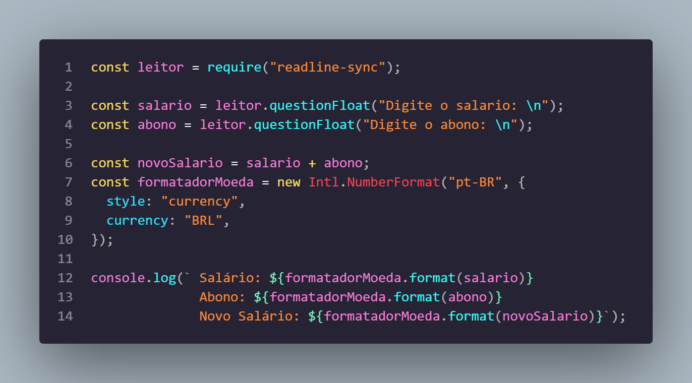 | 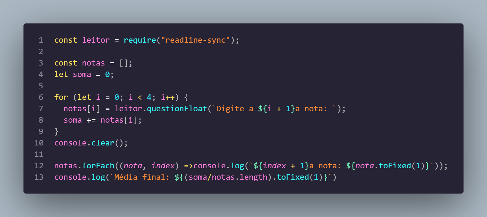 |

| Exercício 03: Salário Líquido | Exercício 04: Diferença de Produtos |
| :---: | :---: |
| 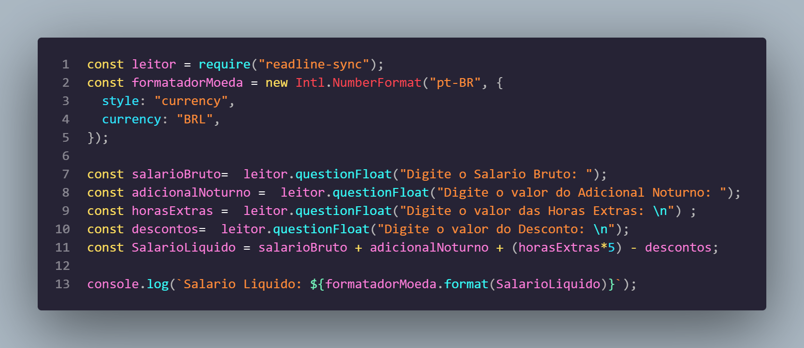 | 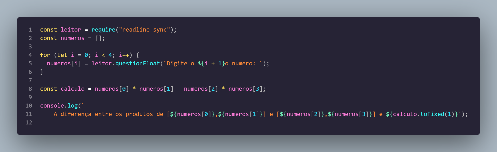 |

</details>

<details>
<summary><b>📂 Ver evidências da Aula 03 — Condicionais IF e SWITCH (Exercícios 1 a 7)</b></summary>

<br />

| Ex. 01 (IF): Soma A + B vs C | Ex. 02 (IF): Paridade e Sinal |
| :---: | :---: |
| 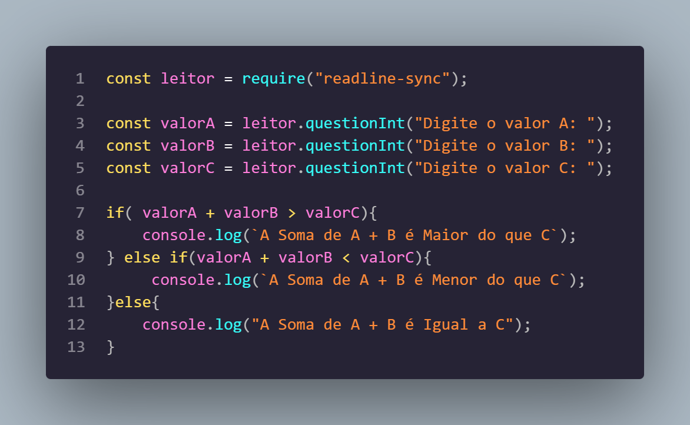 | 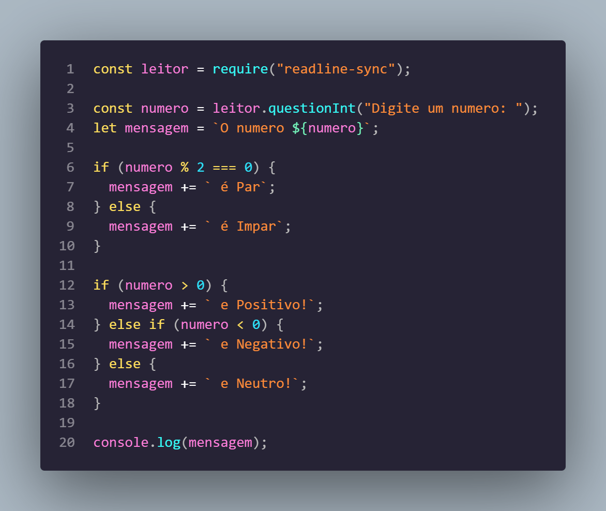 |

| Ex. 03 (IF): Doação de Sangue | Ex. 04 (IF): Classificação Animal |
| :---: | :---: |
| 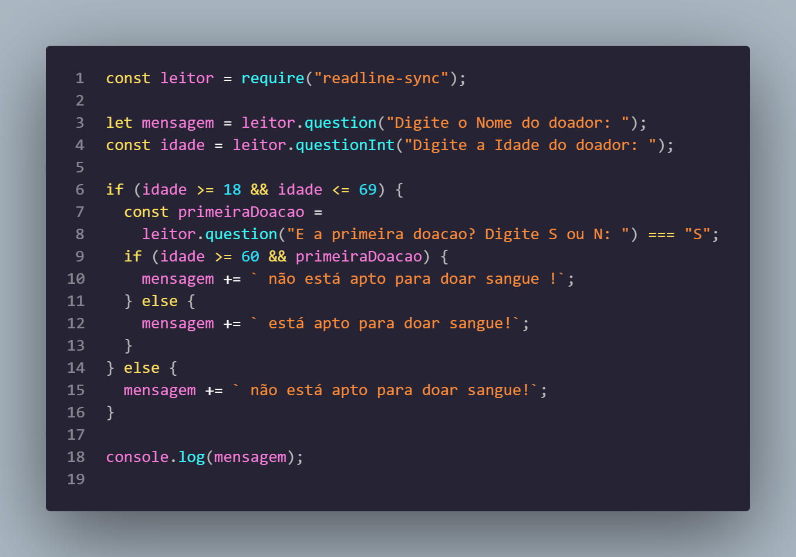 | 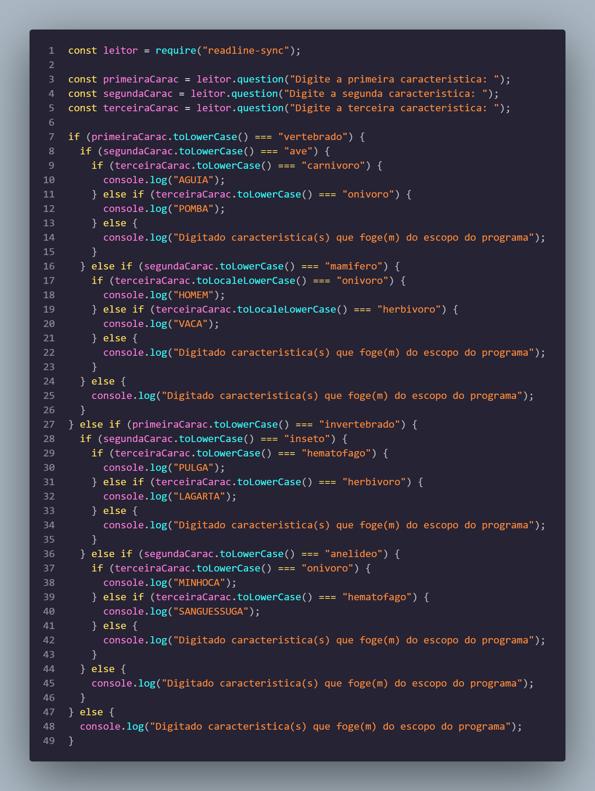 |

| Ex. 05 (SWITCH): Lanchonete | Ex. 06 (SWITCH): Reajuste de Cargo |
| :---: | :---: |
| 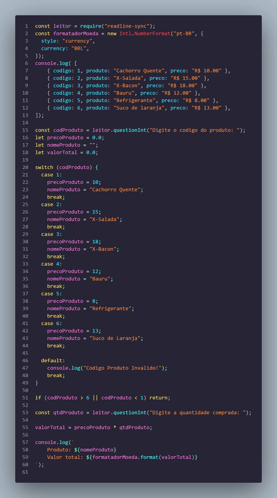 | 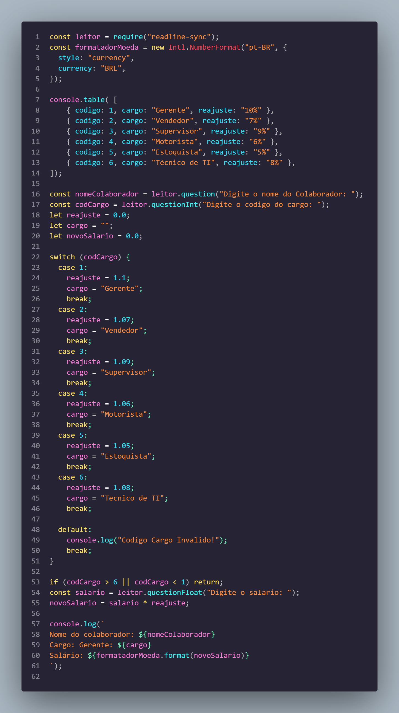 |

| Ex. 07 (SWITCH): Calculadora |
| :---: |
| 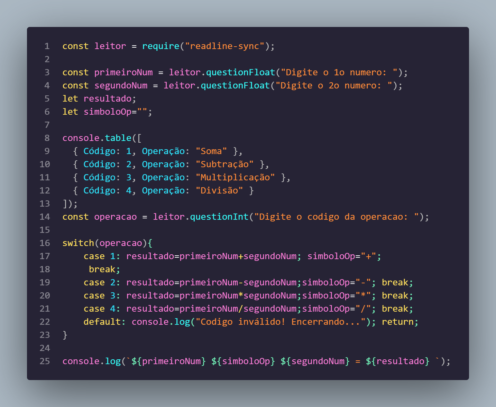 |

</details>

<details>
<summary><b>📂 Ver evidências da Aula 04 — Laços de Repetição, Vetores e Matrizes</b></summary>

<br />

| Ex. 01 (FOR): Múltiplos no Intervalo | Ex. 03 (WHILE): Censo Etário |
| :---: | :---: |
| 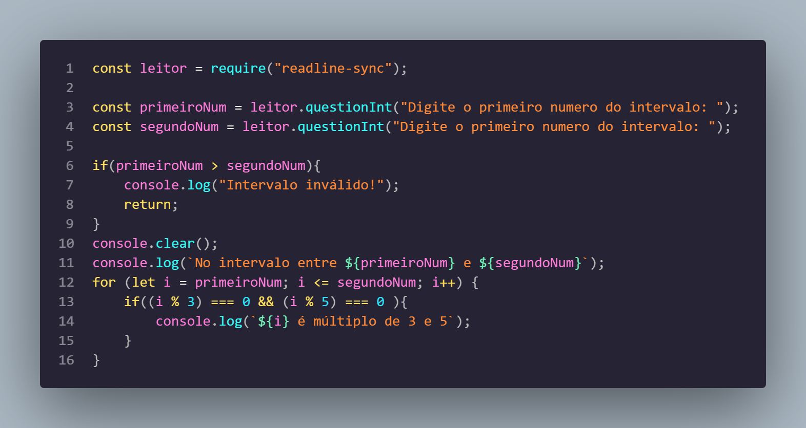 | 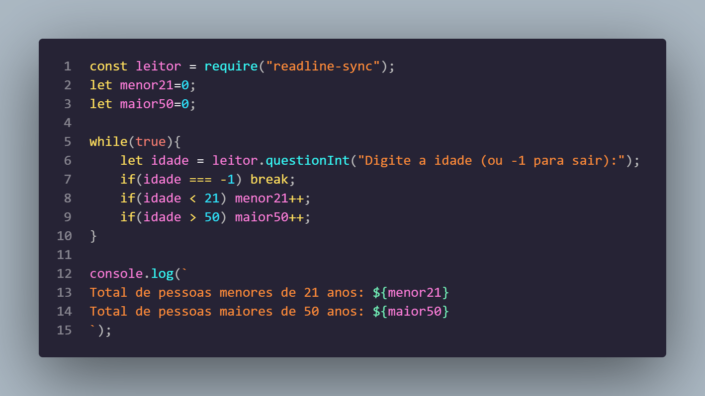 |

| Ex. 05 (DO...WHILE): Soma de Positivos | Ex. 07 (VETORES): Busca Linear |
| :---: | :---: |
| 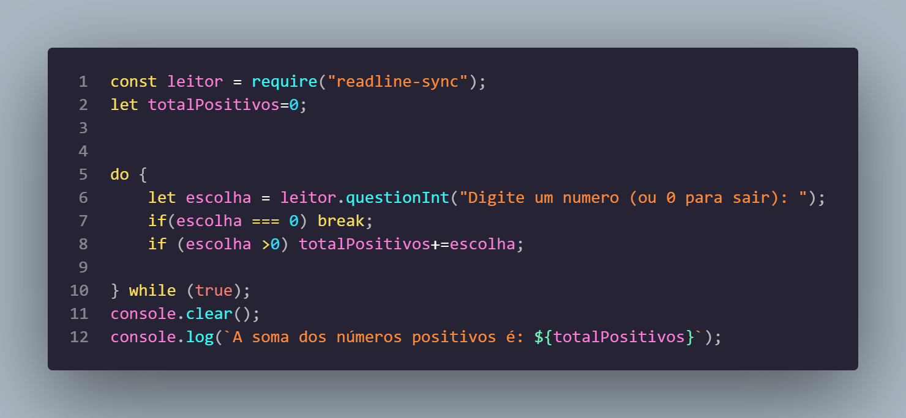 | 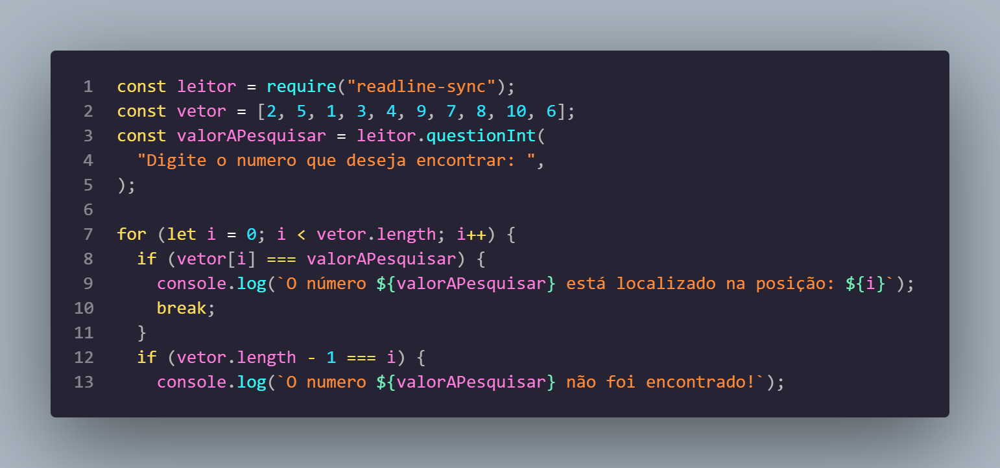 |

| Ex. 09 (MATRIZES): Diagonais Principal e Secundária |
| :---: |
| 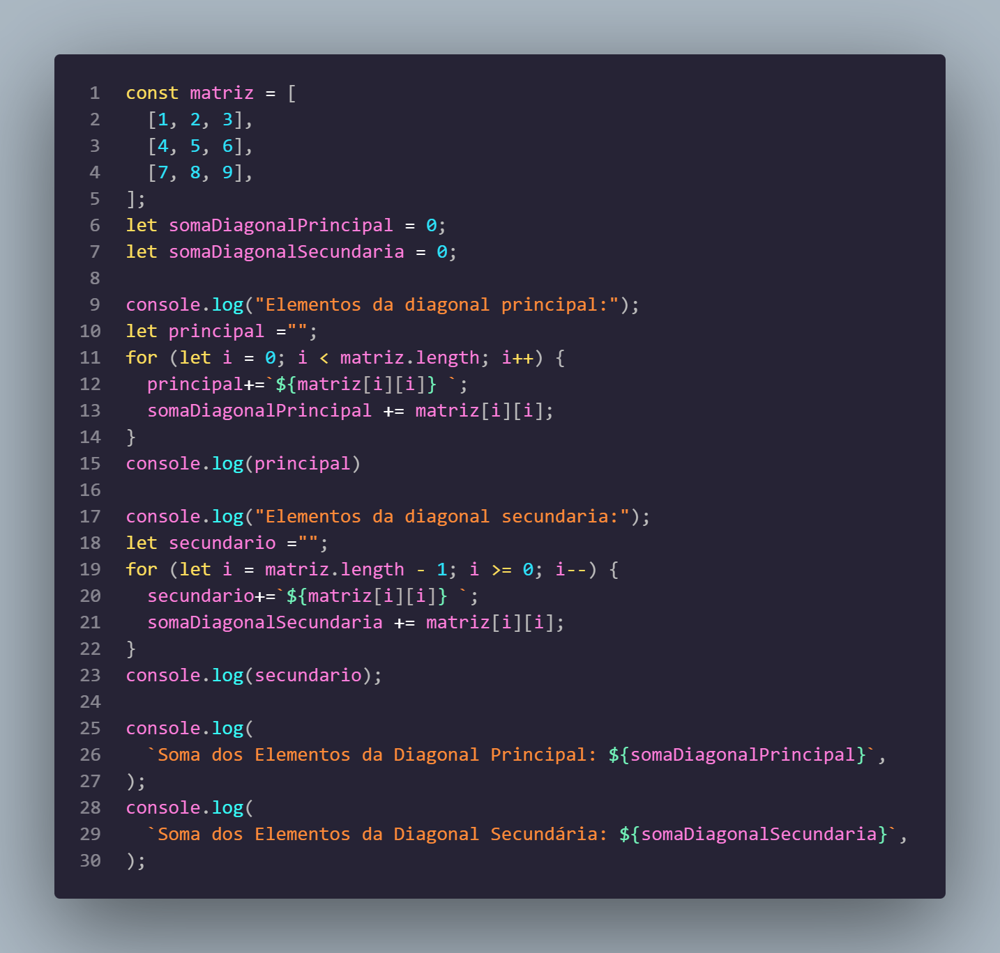 |

</details>

---

## 🎓 Objetivo do Projeto

Este projeto tem finalidade estritamente **educacional e de capacitação técnica**. Foi desenvolvido para consolidar o entendimento profundo dos fundamentos de computação através do ecossistema JavaScript, servindo como base para as etapas avançadas do bootcamp (construção de APIs com TypeScript, NestJS, banco de dados relacionais e bibliotecas frontend como React).

---

## ⚙️ Requisitos e Instalação

### Pré-requisitos de Sistema
* [Node.js](https://nodejs.org/) versão 20.x LTS ou superior instalada.
* [Git](https://git-scm.com/) para versionamento e clonagem.
* Gerenciador de pacotes `npm` (distribuído nativamente com o Node.js).

### Passo a Passo de Instalação

1. Clone o repositório em seu ambiente de desenvolvimento:
```bash
git clone https://github.com/erickystn/generation_JS13_javascript.git
```

2. Acesse o diretório do projeto:
```bash
cd generation_JS13_javascript
```

3. Instale as dependências declaradas no `package.json`:
```bash
npm install
```

---

## 🚀 Como Executar os Exemplos

Cada arquivo JavaScript é autossuficiente e pode ser executado individualmente no terminal passando o caminho relativo para a runtime do Node.js:

```bash
node <caminho_do_arquivo.js>
```

### Exemplos Práticos de Inicialização:

* **Módulo Hello World:**
```bash
node hello-world/HelloWord.js
```

* **Módulo Aula 02 (Operadores e Variáveis):**
```bash
node aula_02/Variaveis.js
node aula_02/Relacionais.js
node aula_02/exercicios/exercicio-1.js
```

* **Módulo Aula 03 (Condicionais):**
```bash
node aula_03/exercicios/condicional_if/exercicio_3.js
node aula_03/exercicios/condicional_switch/exercicio_7.js
```

* **Módulo Aula 04 (Repetições, Vetores e Matrizes):**
```bash
node aula_04/exercicios/repeticao_for/exercicio_1.js
node aula_04/exercicios/vetores/exercicio_7.js
node aula_04/exercicios/matrizes/exercicio_9.js
```

---

## 💻 Exemplos de Uso e Código

Abaixo estão trechos representativos extraídos diretamente dos módulos do repositório:

### 1. Formatação Monetária Nativa e I/O de Ponto Flutuante (`aula_02/exercicios/exercicio-1.js`)
```javascript
const leitor = require("readline-sync");

const salario = leitor.questionFloat("Digite o salario: \n");
const abono = leitor.questionFloat("Digite o abono: \n");

const novoSalario = salario + abono;
const formatadorMoeda = new Intl.NumberFormat("pt-BR", {
  style: "currency",
  currency: "BRL",
});

console.log(` Salário: ${formatadorMoeda.format(salario)}
              Abono: ${formatadorMoeda.format(abono)}
              Novo Salário: ${formatadorMoeda.format(novoSalario)}`);
```
* **Entrada de exemplo:** Salário = `2000.00`, Abono = `500.00`
* **Saída esperada:** `Novo Salário: R$ 2.500,00`

---

### 2. Seleção Múltipla com Tabela e Guard Clause (`aula_03/exercicios/condicional_switch/exercicio_7.js`)
```javascript
"use strict"
const leitor = require("readline-sync");

const primeiroNum = leitor.questionFloat("Digite o 1o numero: ");
const segundoNum = leitor.questionFloat("Digite o 2o numero: ");
let resultado;
let simboloOp = "";

console.table([
  { Código: 1, Operação: "Soma" },
  { Código: 2, Operação: "Subtração" },
  { Código: 3, Operação: "Multiplicação" },
  { Código: 4, Operação: "Divisão" }
]);
const operacao = leitor.questionInt("Digite o codigo da operacao: ");

switch(operacao){
    case 1: resultado = primeiroNum + segundoNum; simboloOp = "+"; break;
    case 2: resultado = primeiroNum - segundoNum; simboloOp = "-"; break;
    case 3: resultado = primeiroNum * segundoNum; simboloOp = "*"; break;
    case 4: resultado = primeiroNum / segundoNum; simboloOp = "/"; break;
    default: console.log("Codigo inválido! Encerrando..."); return;
}

console.log(`${primeiroNum} ${simboloOp} ${segundoNum} = ${resultado}`);
```

---

### 3. Busca Linear em Vetores (`aula_04/exercicios/vetores/exercicio_7.js`)
```javascript
const leitor = require("readline-sync");
const vetor = [2, 5, 1, 3, 4, 9, 7, 8, 10, 6];
const valorAPesquisar = leitor.questionInt("Digite o numero que deseja encontrar: ");

for (let i = 0; i < vetor.length; i++) {
  if (vetor[i] === valorAPesquisar) {
    console.log(`O número ${valorAPesquisar} está localizado na posição: ${i}`);
    break;
  }
  if (vetor.length - 1 === i) {
    console.log(`O numero ${valorAPesquisar} não foi encontrado!`);
  }
}
```

---

## 🧪 Suíte de Testes

Atualmente, o manifesto `package.json` possui a configuração de teste padrão:

```json
"scripts": {
  "test": "echo \"Error: no test specified\" && exit 1"
}
```

### Validação de Testes de Mesa e Verificação Manual
A validação de corretude dos algoritmos foi executada através de **testes de mesa interativos no console**, cobrindo:
1. **Casos Limítrofes (Edge Cases)**: Teste com divisões por zero, idades limítrofes na doação de sangue (17, 18, 60, 69, 70 anos) e intervalos invertidos em repetições.
2. **Entradas Sentinela**: Validação da saída imediata do loop com inserção de `-1` no censo etário e `0` na soma de positivos.
3. **Casos de Não Conformidade**: Verificação de códigos inválidos em menus `switch` com atuação de cláusulas defensivas.

---

## 🛠️ Tecnologias Utilizadas

| Tecnologia | Versão / Padrão | Papel no Projeto |
| :--- | :--- | :--- |
| **[JavaScript](https://developer.mozilla.org/pt-BR/docs/Web/JavaScript)** | ECMAScript 2020+ (ES6+) | Linguagem de programação principal utilizada na implementação de toda a lógica. |
| **[Node.js](https://nodejs.org/)** | 20.x+ | Runtime JavaScript assíncrono orientado a eventos para execução no servidor e terminal. |
| **[readline-sync](https://www.npmjs.com/package/readline-sync)** | `^1.4.10` | Biblioteca de I/O síncrono para captura de dados e strings no terminal. |
| **[Intl API](https://developer.mozilla.org/pt-BR/docs/Web/JavaScript/Reference/Global_Objects/Intl)** | Nativo ECMAScript | Módulo de internacionalização para formatação monetária e de valores no padrão brasileiro. |
| **[Visual Studio Code](https://code.visualstudio.com/)** | — | Ambiente de desenvolvimento integrado (IDE) para escrita, depuração e execução dos códigos. |
| **[Git & GitHub](https://github.com/)** | — | Controle de versão distribuído e hospedagem do repositório remoto. |

---

## 📈 Melhorias e Próximos Passos (Roadmap)

- [ ] **Migração para Módulos ES (ESM)**: Adicionar suporte formal ao padrão `import / export` nativo em substituição ao `require` do CommonJS.
- [ ] **Suíte de Testes Automatizados**: Implementar testes unitários automatizados com [Jest](https://jestjs.io/) ou [Vitest](https://vitest.dev/) para validar as funções matemáticas e os algoritmos de busca.
- [ ] **Interface de Terminal Enriquecida**: Integrar bibliotecas de estilo de console como [Chalk](https://www.npmjs.com/package/chalk) e [Inquirer](https://www.npmjs.com/package/inquirer) para seleções com navegação por setas.
- [ ] **Validação com Esquemas**: Implementar validações robustas de entradas de dados utilizando bibliotecas como [Zod](https://zod.dev/).
- [ ] **Transpilação e Tipagem Estática**: Modularizar os exercícios em TypeScript, dando continuidade ao aprendizado visto no módulo subsequente do bootcamp.

---

## 🤝 Como Contribuir

Contribuições para fins de estudo e melhorias no código são sempre bem-vindas:

1. Faça um **Fork** do projeto.
2. Crie uma branch para sua funcionalidade ou correção:
   ```bash
   git checkout -b feature/minha-melhoria
   ```
3. Realize seus commits seguindo boas práticas de mensagens semânticas:
   ```bash
   git commit -m "feat: adiciona novos testes de mesa para manipulacao de matrizes"
   ```
4. Envie as alterações para sua branch remota:
   ```bash
   git push origin feature/minha-melhoria
   ```
5. Abra um **Pull Request** detalhando as alterações propostas.

---

## 👤 Autor & Créditos

* **Desenvolvedor:** [Ericky Sant'ana](https://github.com/erickystn)
* **Organização e Formação:** [Generation Brasil](https://brazil.generation.org/) — *Bootcamp JavaScript Full Stack (Turma 13)*
* **Facilitação Pedagógica:** [Rafael](https://github.com/rafaelq80)

---

## 📄 Licença

Este projeto está sob a licença **MIT**. Para maiores informações, consulte os termos legais no arquivo de licença ou sinta-se à vontade para estudar, clonar e aprimorar o código.
